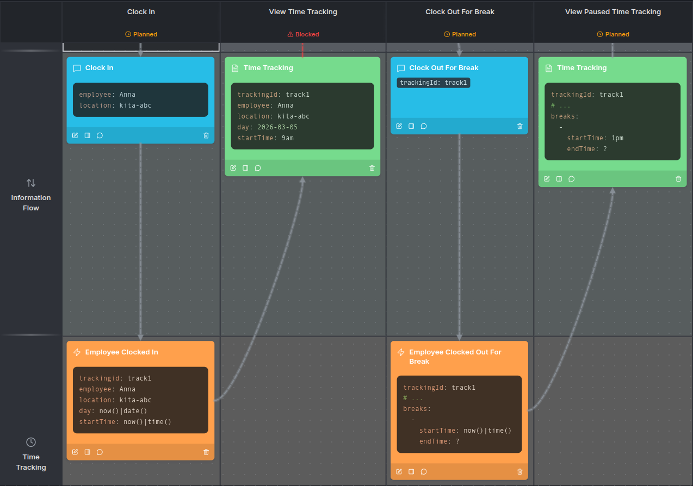

# Example Data

> Add concrete YAML example data to Command, Event, and Information elements in prooph board.

## Overview

Example Data teaches AI agents how to add concrete, business-friendly data samples to element descriptions using YAML code blocks. Instead of abstract type definitions like `string|format:uuid`, this skill uses real-looking values like `employee: Anna` or `trackingId: track1` — making the model understandable to non-technical stakeholders.

## Why Example Data

- **Clearer communication** — Concrete values help business users immediately understand what data flows through the system
- **Faster validation** — Stakeholders can spot missing fields or incorrect assumptions at a glance
- **Better agent guidance** — Example data gives the AI agent a reference for what kind of information to expect and document

## When to Use

| ✅ Use Example Data | ❌ Skip It |
|---|---|
| Documenting command payloads | Fields are obvious from the element name alone |
| Showing state changes after events | Technical specs already fully cover the data structure |
| Capturing available information from queries | The element is self-explanatory and well-understood |

## Usage

Once installed, your AI agent will know how to add YAML example data to element descriptions. Examples use `yaml` code blocks with concrete values:

```yaml
trackingId: track1
employee: Anna
location: loc-abc
day: 2026-03-05
startTime: 9am
```

### Examples



## Best Practices

- Use concrete values, not type definitions (save those for element details)
- Include only the fields relevant to this specific process step
- Use `# ...` to indicate that unchanged data exists in the state
- Use expressions like `now()|time()` to show dynamic values computed at runtime
