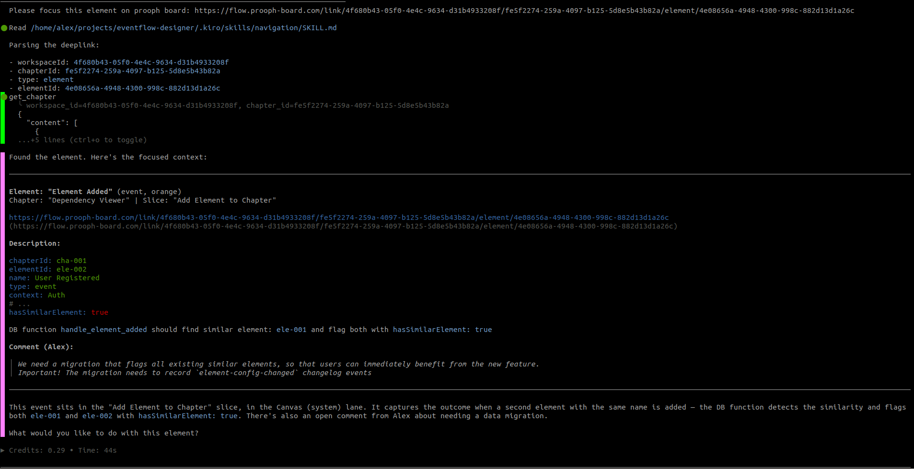

# Navigation

> Parse deeplinks, retrieve chapter data via MCP, focus on referenced elements or slices, and generate deeplinks for precise user navigation.

## Overview

Navigation teaches AI agents how to interpret and generate deeplinks for prooph board. Instead of treating deeplinks as URLs to fetch, the agent learns to parse identifiers, retrieve chapter data via MCP tools, focus responses on specific elements or slices, and generate precise navigation links for users.

## Why Navigation

- **Precise targeting** — Agents can focus responses on specific elements or slices referenced in deeplinks
- **Better context** — Parse workspace, chapter, and element identifiers to retrieve the exact data needed
- **Clear communication** — Generate deeplinks when referencing specific modeling issues or elements
- **Efficient workflow** — Navigate directly to problem areas without analyzing entire chapters

## When to Use

| ✅ Use Navigation | ❌ Skip It |
|---|---|
| User provides a prooph board deeplink | Generic modeling questions without specific element references |
| Referencing specific elements in feedback | Working with entire chapters at once |
| Guiding users to specific modeling issues | No need for precise element/slice targeting |
| Asking questions about particular elements or slices | User doesn't need navigation links in responses |

## Usage

Once installed, your AI agent will know how to:

### Resolve Deeplinks

When a user provides a deeplink like:
```
https://flow.prooph-board.com/link/{workspaceId}/{chapterId}/element/{elementId}
```

The agent will:
1. Parse the identifiers (workspaceId, chapterId, type, targetId)
2. Retrieve chapter data via `get_chapter_details()` MCP tool
3. Locate the target element or slice
4. Focus the response ONLY on that target

### Generate Deeplinks

When referencing specific elements or slices, the agent will generate precise navigation links:

```
The command "Place Order" may violate modeling rules:
https://flow.prooph-board.com/link/{workspaceId}/{chapterId}/element/{elementId}
```

## Best Practices

- **Never fetch deeplinks as URLs** — they are pointers, not resources
- **Always scope responses** — when a deeplink is provided, focus only on the referenced target
- **Use exact IDs** — never invent or approximate identifiers
- **Generate links for clarity** — include deeplinks when pointing to specific modeling issues
- **Ask when unclear** — if the deeplink structure is invalid or incomplete, ask for clarification

## Examples

### Resolving a Deeplink

User provides:
```
https://flow.prooph-board.com/link/ws123/ch456/element/elem789
```

Agent:
1. Extracts: `workspaceId=ws123`, `chapterId=ch456`, `type=element`, `targetId=elem789`
2. Calls: `get_chapter_details("ws123", "ch456")`
3. Finds element with ID `elem789`
4. Responds with information scoped to that element only

### Generating Deeplinks

You can get a deeplink by right-clicking on an element or slice on prooph board and choose
**Copy Link** from the context menu. This will copy the deeplink into clipboard and you can
paste it into your agent chat.

Prompts like:

> Please focus on element: [deeplink]

followed by specific instructions or questions should be enough to activate the skill.


