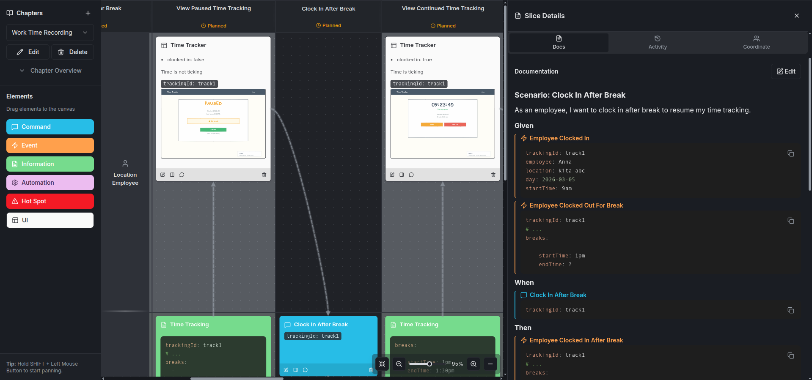

# Slice Scenarios

> Document process behavior with Given-When-Then scenarios in slice details on prooph board.

## Overview

Slice Scenarios teaches AI agents how to write structured **Given-When-Then scenarios** in slice detail sections. Instead of describing behavior in free-form text, scenarios provide a clear, testable specification of what happens at each step in the Event Model.

Think of scenarios as lightweight specifications that sit alongside the visual model — they document the exact conditions, data, and expected outcomes for each process step.

## Why Slice Scenarios

- **Clarity** — Given-When-Then format forces precise thinking about preconditions, actions, and outcomes
- **Completeness** — Scenario structure ensures no step is missing its context or expected result
- **Shared language** — Business stakeholders and developers can both read and validate scenarios
- **Living documentation** — Scenarios stay with the model on the board, not buried in external documents

## When to Use

| ✅ Use Slice Scenarios | ❌ Skip It |
|---|---|
| Complex process steps with multiple conditions | Simple CRUD operations that are obvious from the model |
| Steps with important business rules | Early exploration phase where details are still unclear |
| Compliance or audit requirements | Steps that are self-explanatory |

## Usage

Once installed, your AI agent will know how to write Given-When-Then scenarios in slice details. Scenarios use YAML code blocks for structured data and reference element names for clarity:

### Example

## Best Practices

- Keep scenarios focused on **one behavior** per scenario
- Use concrete example data in `Given` and `Then` blocks
- Reference elements by their **exact names** on the board
- Use `now()|time()` and `now()|date()` for dynamic values
- Add multiple scenarios when a slice has important edge cases or error conditions
