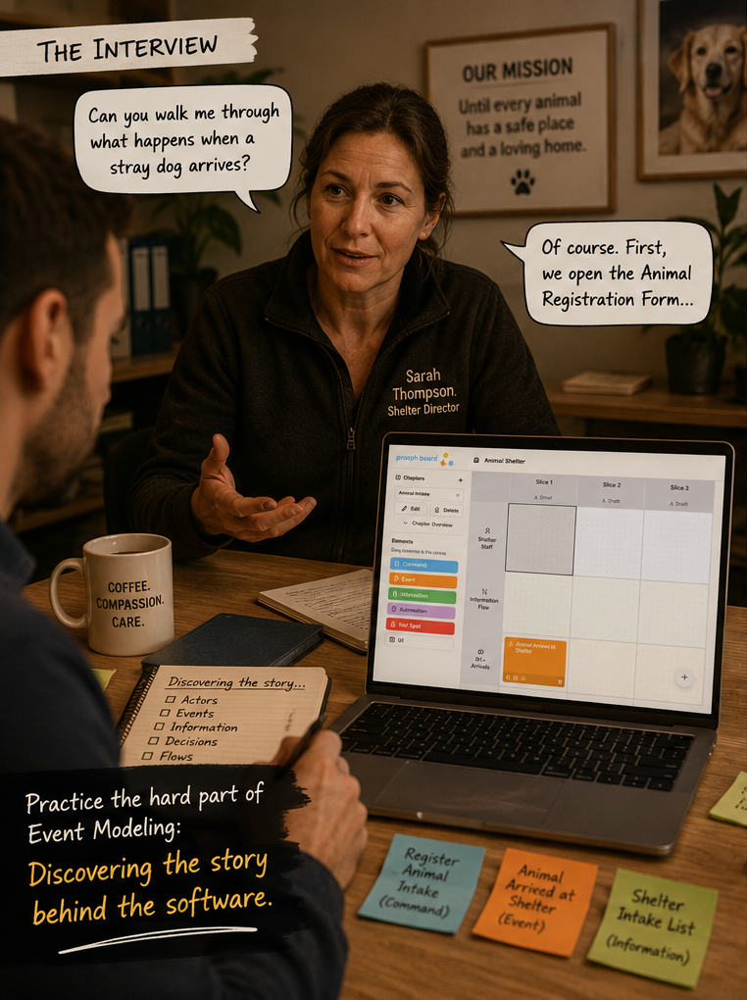
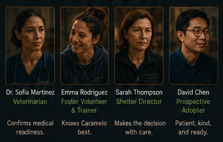

# Animal Shelter Academy

A training ground for Event Modeling on [prooph board](https://prooph-board.com)

Meet the characters of the [Animal Shelter story](https://www.linkedin.com/posts/alexander-miertsch-prooph-board_businessseriesmodeling-businessseriesmodeling-share-7470224109180907521-ofYG) 

## How does it work?

You install this repo as an AI skill to your favorite AI agent. For best results, use a model with thinking capability.

The skill instructs your agent to play a character of the Animal Shelter story:

You can ask questions about the Animal Shelter and practice your discovery and Event Modeling skills.

## Getting Started

Install the skill to your favorite AI like `Claude Code`, `Codex`, you name it.

Use this prompt to start the training:

> I want to practice episode [number] of the animal shelter academy in [maturity_mode] mode.

*For best coaching tips alongside the shelter simulation, install available [modeling skills](http://127.0.0.1:3000/tags/modeling.html), too* 

Switch to the **Animal Shelter Academy** workspace on prooph board and model the software while interviewing the characters.

*Tip: You can't find the workspace? Choose "Academy" from the top menu on prooph board.*

## Maturity Mode

1️⃣ Guided

This is the beginner-friendly mode.

When interviewing story actors, they answer in a way that helps you connect what you're hearing with Event Modeling concepts.

You'll also receive hints about what you've just discovered and suggestions for how it might fit into a model.

Think of it as learning with a mentor sitting next to you.

2️⃣ Practice

The conversations become more realistic.

Artifacts are no longer revealed automatically.

Stakeholders won't always volunteer information unless you ask the right questions.

You need to listen more carefully, follow up on clues, and actively drive the discovery process.

Think of it as supervised practice.

3️⃣ Reality

All training wheels are off.

Stakeholders behave like real domain experts.

They talk from their own perspective.

They skip details that seem obvious to them.

They disagree.

They have blind spots.

Sometimes they simply don't know.

Now you're not following a script anymore.

You're facilitating a discovery workshop.

And suddenly the most important skill is no longer modeling.

It's curiosity.

Why this matters 💡

Most discovery techniques are easy to understand.

What's difficult is developing the judgment to know:

which questions to ask,
when to ask them,
what information matters,
and what assumptions still need validation.

That's something that usually takes years of experience, shorten the learning time by practicing in a safe environment.

## Available Episodes

### Episode 1 - Intake

You interview `Sarah Thompson` the shelter director about animal intake.

### Episode 2 - Medical Assessment

coming soon ...
